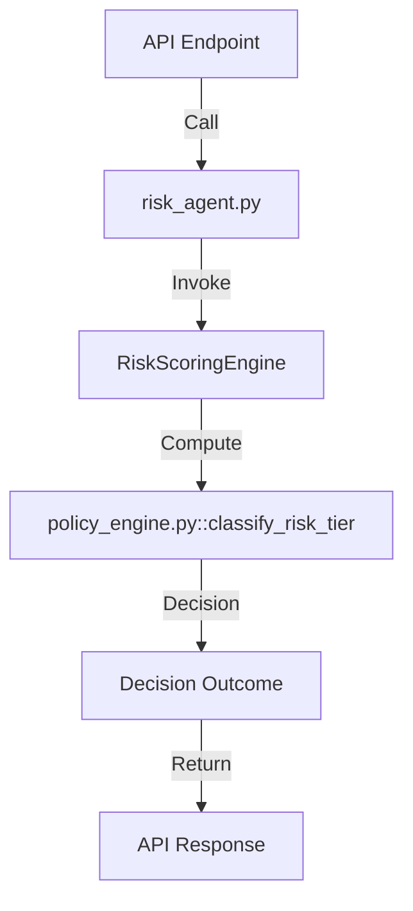

# Risk Decision Call Graph

**Explanation**:
- The API router (e.g., `backend/app/api/routes_risk.py` line 39) calls `risk_agent.process_transaction`.
- `risk_agent` (lines 350‑380) delegates to `RiskScoringEngine` which calculates the numeric risk score.
- The score is passed to `PolicyEngine.classify_risk_tier` (lines 45‑100) to determine the action (`AUTO_EXECUTE`, `REVIEW_REQUIRED`, `NEVER_EXECUTE`).
- The final decision is returned to the API response.
